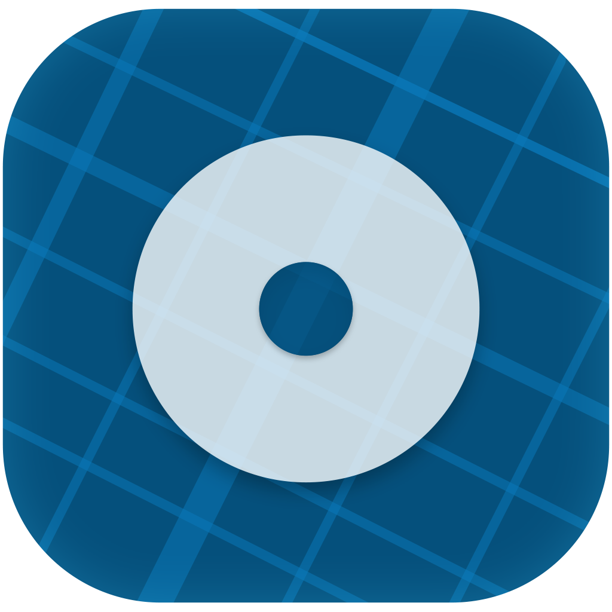

   

      &nbsp
    &nbsp
   

  
  # OTLB APP

* [Firebase new project](#firebase-new-project)
* [Link firebase project with your android app](#link-firebase-project-with-your-android-app)

  

## Firebase new project

1- الدخول للرابط التالي: https://firebase.google.com/  
2- الضغط على **GET STARTED**  
3- قم بإنشاء مشروع جديد بالضغط على **Add project**  

4- قم بإدخال اسم المشروع الخاص بك في خانة **Project Name**  
5- اختيار الدولة من قائمة **Country/region**  
6- الضغط على **CREATE PROJECT**  

#+ATTR_HTML align="center"
[]

#### بهذه الخطوات نكون قد أنشأنا مشروع  Firebase بنجاح 
#### والآن لربط المشروع بتطبيق الاندرويد نقوم باتباع الخطوات التالية:  

## Link firebase project with your android app

7- الضغط على **Add Firebase to your Android app**  

8- قم بنسخ اسم الباكج من ملف المانيفست بالاندرويد ثم إدخاله في خانة **Android package name**  
9- الضغط على **REGISTER APP**

10- قم بتحميل ملف **json**  
بالضغط على **Download google-services.json**    الصورة التالية توضح محتويات الملف
 

11- العودة للتطبيق في الاندرويد ستوديو ثم نسخ الملف **json**  
ضمن الملفات الخاصة بالتطبيق

12- الضغط على **CONTINUE**   ثم **FINISH**  

